# Design: Agent-Agnostic Rules Sync

## Overview

A single Python script (`~/.ai-agent/scripts/sync_agent_rules.py`) that manages a canonical rule/skill store at `~/.ai-agent/` and generates agent-native configs. Subcommands: `init`, `sync`, `reconfigure`, `add-rule`, `remove-rule`, `set`, `status`, `clean`, `archive-skill`, `restore-skill`.

Zero external dependencies. Uses only the Python 3 standard library. The script is version-controlled and pushed to GitHub. Personal content (rules, skills, manifest) is gitignored and stays local.

## Technology Decisions

| Decision | Choice | Rationale |
|----------|--------|-----------|
| Language | Python 3.10+ | Pre-installed on macOS 13+ and most Linux. Uses `match`, `X \| Y` union types. |
| Dependencies | None | Zero pip installs. Clone and run. |
| Config format | JSON (`manifest.json`) | `json` is stdlib. Generated by `init`, rarely hand-edited. |
| Interactive prompts | `curses + input()` | curses for TUI multi-select, input() fallback for non-TTY. Both stdlib. |
| Deduplication | `difflib.SequenceMatcher` | stdlib, 80% ratio threshold for similar detection. |
| CLI parsing | `argparse` | stdlib, supports subcommands and flags. |

## Repository Boundary

```
~/.ai-agent/
├── .gitignore              # [committed]
├── README.md               # [committed]
├── scripts/                # [committed]
│   └── sync_agent_rules.py
├── openspec/               # [committed] planning artifacts
│
├── manifest.json           # [GITIGNORED] user's agent targets and rule metadata
├── rules/                  # [GITIGNORED] user's personal rules
├── skills/                 # [GITIGNORED] user's personal skills
└── docs/                   # [GITIGNORED] user's personal notes, plans, references
```

### .gitignore

```
# Personal content -- never committed
manifest.json
rules/
skills/
docs/

# Python
__pycache__/
*.pyc
```

### Install

```bash
git clone <repo> ~/.ai-agent
~/.ai-agent/scripts/sync_agent_rules.py init
```

No pip. No venv. No package manager. Requires Python 3.10+ (macOS 13+ ships with it).

## Architecture

```
sync_agent_rules.py (~1700 lines, single file)
├── Constants & paths
├── Manifest (read/write JSON via stdlib json module)
├── Importers (one per agent)
│   ├── import_cursor()
│   ├── import_codex()
│   ├── import_claude()
│   ├── import_gemini()
│   ├── import_kiro()
│   └── import_skills()
├── Deduplication engine
├── Generators (one per agent + AGENTS.md)
│   ├── gen_cursor()
│   ├── gen_codex()
│   ├── gen_claude()
│   ├── gen_gemini()
│   ├── gen_kiro()
│   ├── gen_antigravity()
│   └── gen_agents_md()
├── Interactive prompts (multi_select helper)
└── CLI entrypoints (cmd_init, cmd_sync, cmd_reconfigure, cmd_add_rule, cmd_remove_rule, cmd_set, cmd_status, cmd_clean, cmd_archive_skill, cmd_restore_skill)
```

## Data Flow

```mermaid
graph TD
  subgraph initMode [init mode]
    sourceSelect["multi_select: pick sources"]
    importPhase["run importers for selected sources"]
    dedupPhase["deduplicate across sources"]
    targetSelect["multi_select: pick targets"]
    writeCanonical["write rules/, skills/, manifest.json"]
    runSync["call cmd_sync()"]
  end

  sourceSelect --> importPhase
  importPhase --> dedupPhase
  dedupPhase --> targetSelect
  targetSelect --> writeCanonical
  writeCanonical --> runSync

  subgraph syncMode [sync mode]
    readManifest["read manifest.json"]
    forEachRule["for each active rule target"]
    forEachSkill["for each active skill target"]
    genFiles["run gen_agent()"]
    genSymlinks["create/update symlinks"]
  end

  readManifest --> forEachRule
  readManifest --> forEachSkill
  forEachRule --> genFiles
  forEachSkill --> genSymlinks
```



## Key Data Structures

### ImportedRule (used during init)

```python
@dataclass
class ImportedRule:
    id: str                    # slug, e.g. "my-rule"
    content: str               # plain markdown (no frontmatter)
    source: str                # "cursor", "codex", etc.
    cursor_meta: dict | None   # {alwaysApply, description, globs}
```

### Manifest (JSON schema)

```json
{
  "version": "1.0",
  "updated": "2026-02-25",
  "imported_from": ["cursor", "codex"],
  "active_targets": {
    "rules": ["cursor", "codex", "claude", "kiro", "gemini", "agents-md"],
    "skills": ["cursor", "codex", "gemini", "antigravity"]
  },
  "rules": [
    {
      "id": "example-rule",
      "file": "example-rule.md",
      "imported_from": "cursor",
      "cursor": {
        "alwaysApply": true,
        "description": "Example rule description"
      }
    }
  ],
  "skills": {
    "shared_dir": "skills"
  },
  "agents_md": {
    "paths": ["~/projects/AGENTS.md"],
    "header": "# Workspace AGENTS Rules",
    "preamble": "These rules apply across this workspace unless explicitly overridden."
  }
}
```

### Cursor Frontmatter Parsing (YAML subset)

The Cursor importer needs to parse `.mdc` YAML frontmatter (between `---` delimiters). Rather than pulling in PyYAML, the script includes a minimal parser that handles the flat key-value subset Cursor uses:

```python
def parse_frontmatter(text: str) -> tuple[dict, str]:
    """Parse simple YAML frontmatter (key: value pairs only).
    Returns (metadata_dict, remaining_content)."""
```

This handles `alwaysApply: true`, `description: "..."`, and `globs: "..."` -- the only keys Cursor frontmatter uses. No anchors, no nested objects, no flow sequences.

## Generated File Detection

All importers check whether a source file starts with the generated header (`# Generated from ~/.ai-agent/`). If it does, the file is skipped with a warning. This prevents circular re-import when running `init` after a previous `sync` has already written to agent directories.

## Importer Details

### Cursor Importer

1. Glob `~/.cursor/rules/*.mdc`
2. Skip files whose content (after frontmatter) starts with the generated header
3. For each remaining file, split on `---` delimiters to extract frontmatter
3. Parse frontmatter with `parse_frontmatter()` -> extract `alwaysApply`, `description`, `globs`
4. Remaining content after second `---` is the rule body (plain markdown)
5. Derive `id` from filename: `my-rule.mdc` -> `my-rule`
6. Return list of `ImportedRule` with `cursor_meta` populated

### Codex Importer

1. Read `~/.codex/model-instructions.md`
2. If the file starts with the generated header, skip entirely with warning
3. Split on `## Source: ` pattern (each section is one rule)
3. Derive `id` from the source filename: `## Source: my-rule.mdc` -> `my-rule`
4. Content is everything between section headers
5. Skip the file header preamble

### Other Importers (Claude, Gemini, Kiro)

Claude and Gemini: Read single markdown file. If it starts with the generated header, skip entirely with warning. Otherwise, split on `# ` (top-level heading) boundaries. Each heading becomes a rule.

Kiro: Glob `~/.kiro/steering/*.md`. Skip files starting with the generated header. Each remaining file becomes a rule. ID from filename.

### Skills Importer

1. Scan source agent's skills directory
2. Skip symlinks (they point to another agent, not original content)
3. Skip known system directories (e.g., `.system/`)
4. Copy remaining directories to `~/.ai-agent/skills/`
5. If name collision, keep first source's version and warn

## Generator Details

### Cursor Generator

For each rule (not excluded from cursor):
1. Read `rules/{file}` content
2. Build `.mdc` frontmatter from `cursor` metadata in manifest
3. Write to `~/.cursor/rules/{id}.mdc`

Stale file cleanup: scan `~/.cursor/rules/*.mdc` for files with the generated header whose rule ID (derived from filename) is not in the current manifest. Remove these orphaned files.

For skills: symlink each `~/.ai-agent/skills/{name}` -> `~/.cursor/skills/{name}`

### Codex Generator

1. Concatenate all non-excluded rules with `## Rule: {id}` section headers
2. Prepend generated-file header
3. Write to `~/.codex/model-instructions.md`

For skills: symlink each `~/.ai-agent/skills/{name}` -> `~/.codex/skills/{name}`, preserving `.system/` and other non-symlink entries.

### Claude / Gemini / Kiro Generators

Concatenate all non-excluded rules into a single markdown file:
- Claude: `~/.claude/CLAUDE.md`
- Gemini: `~/.gemini/GEMINI.md` (also symlinks skills)
- Kiro: `~/.kiro/steering/conventions.md`

### Antigravity Generator

Skills only: symlink `~/.ai-agent/skills/{name}` -> `~/.gemini/antigravity/skills/{name}`

### AGENTS.md Generator

For each path in `agents_md.paths`:
1. Write header and preamble from manifest
2. For each non-excluded rule, write a one-line summary derived from the rule's `cursor.description` field if present, otherwise the first non-empty line of the rule content (truncated to 120 chars)
3. Numbered list format: `N. **{id}** -- {summary}`

## Symlink Strategy

```
# Before sync (typical starting state)
~/.codex/skills/some-skill -> ~/.cursor/skills/some-skill

# After sync (new state)
~/.codex/skills/some-skill -> ~/.ai-agent/skills/some-skill
~/.cursor/skills/some-skill -> ~/.ai-agent/skills/some-skill
```

During sync for each skill target:
1. List all entries in agent's skills directory
2. For each symlink pointing into `~/.ai-agent/skills/`: remove it (will be re-created fresh)
3. For each skill in `~/.ai-agent/skills/`, create symlink if not already present
4. Non-symlink directories and symlinks pointing elsewhere (e.g., agent-specific skills) are left untouched

## Error Handling

- Missing source directories during import: skip with warning, not an error
- Missing target directories during sync: create parent dirs as needed (`mkdir -p`)
- Broken symlinks: remove and recreate
- Manifest parse failure: exit with clear error message and path
- `--dry-run`: all write operations log what they would do instead of executing

## Backup System

All mutating commands (`sync`, `add-rule`, `remove-rule`, `clean`) create a timestamped backup before modifying files:

```
~/.ai-agent/backups/
└── 20260228T143000Z/
    ├── meta.json          # {created, command}
    └── files/
        └── .cursor/rules/old-rule.mdc   # relative to $HOME
```

- `init_backup(command)` creates a new session directory
- `backup_file(path)` copies a file to the session before overwriting
- `backup_directory(path)` copies a directory tree before overwriting
- `latest_backup()` returns the most recent session for `clean` restores
- `restore_from_backup(session, targets)` copies backed-up files to their original locations

## Skill Archiving

Skills can be temporarily removed from active sync without deleting them:

```
~/.ai-agent/skills-archived/
├── dormant-skill-a/
├── dormant-skill-b/
└── ...
```

- `archive-skill <name>` moves a skill directory from `skills/` to `skills-archived/`, then runs sync
- `restore-skill <name>` moves it back, then runs sync
- Both support `--dry-run` and multiple names
- `archive-skill --list` shows archived skills

## Interactive Multi-Select

The CLI provides a curses-based TUI for multi-select prompts (source selection, target selection), with a plain `input()` fallback for non-TTY environments:

- **Curses mode** (TTY detected): Arrow keys navigate, Space toggles, `a` selects all, Enter confirms, `q` aborts
- **Fallback mode** (non-TTY or curses unavailable): Numbered list with comma-separated input
- **Auto-accept mode** (`--yes` flag): Skip prompts, use defaults

## File Generation Header

All generated files start with:

```markdown
# Generated from ~/.ai-agent/ -- do not edit directly
# Run: ~/.ai-agent/scripts/sync_agent_rules.py sync
# Last synced: {ISO timestamp}

```
